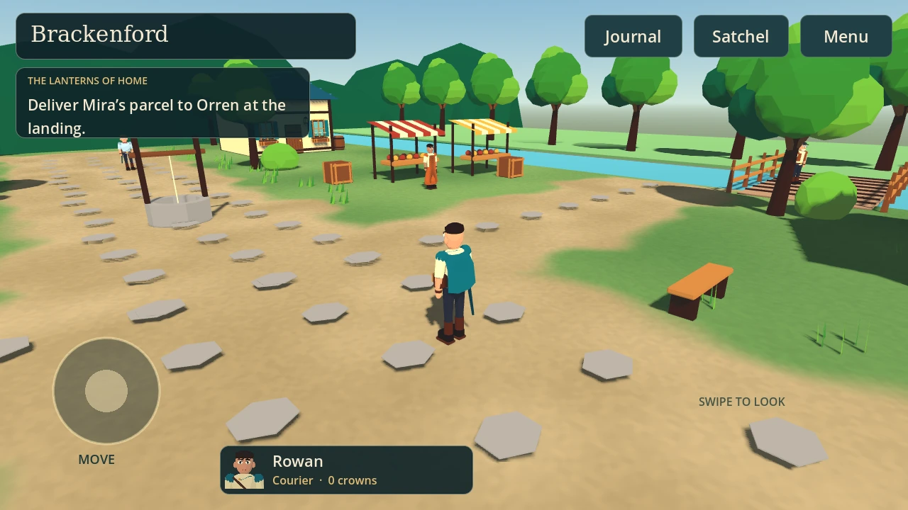

# Jrpg

A story-led, turn-based 3D JRPG designed around a mobile playtesting workflow. The goal is a complete game and practical learning through its development; commercial release is an optional additional outcome. Keep costs low and evaluate paid tools only when they offer a demonstrated benefit.

**The Brackenford opening is now real, freely rotatable 3D in Godot 4.5.1 (0.2.2).**

[Download the Android preview from Releases](https://github.com/Jamie1171/Jrpg/releases),
or check [the Android build](https://github.com/Jamie1171/Jrpg/actions/workflows/android.yml).

The opening includes the inn, village and woodland; portrait conversations;
Rowan and Cael's first battle; optional fishing and a permanent reward; a journal,
inventory, original music and local saves. It ends with Ysra's arrival, before the
festival and the raid. Exploration uses modelled 3D environments, rigged Blender characters, a left
movement stick and a right-side swipe camera. This is an early 3D art pass, not
the full game or finished commercial-quality art.

- [Current game design and production plan](docs/design/game-design-and-production-plan.md): combat, progression, equipment, parallel crafting routes, random enchanting, exploration and milestones toward the complete game.
- [Iron ore asset trial](docs/production/iron-ore-asset-trial.md): first prepared Meshy model, before/after comparison and in-game test.
- [3D direction and asset pipeline](docs/production/3d-direction.md)
- [Xbox controller controls](docs/production/controller-controls.md)
- [Phone playtesting guide](docs/production/phone-playtesting.md)
- [Build and technical notes](docs/production/build-notes.md)
- [Art and audio provenance](docs/art/asset-manifest.md)

Current creative direction: a cohesive adventure with loss, betrayal, developing party relationships and a decisive confrontation with its main antagonist. Mining, crafting, fishing and other trades offer substantial optional achievement and rewards alongside that story.

- [From story to a playable Android game](docs/production/from-story-to-playable.md): historical initial roadmap; its 2D visual proposal and initial scope are superseded by the current plan.
- [The Unfinished Dawn — alternative story treatment](docs/story/the-unfinished-dawn-treatment.md): protagonist, antagonist, staggered companion recruitment, revealed backstory, betrayal, chapter progression and ending; includes a separate optional trade progression.
- [Android JRPG research and story foundations](docs/research/android-jrpg-market-and-story-foundations.md): the original investigation and earlier concepts. **The Hearthroad remains an available option**, alongside The Names We Keep and The Wandering Table. Its recommendation reflects the earlier brief, not a final selection.

The research compares 13 Android JRPGs and two adjacent crafting games and records 45 public Google Play review observations. All proposed titles, casts, settings and mechanics remain discussion drafts; no story has been selected as final canon.

The `game/` folder is the native Godot project. Open `game/project.godot` in Godot
4.5.1 to run it on a computer. Android APKs build automatically through GitHub
Actions; no editor installation on the player's phone is required.
