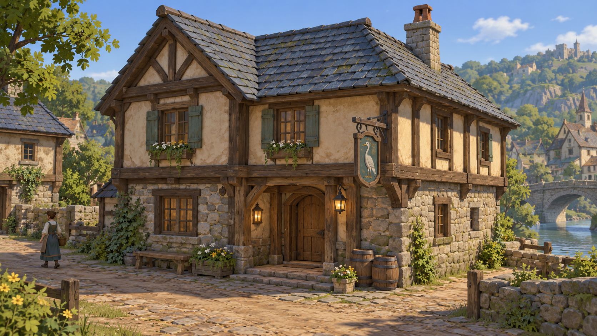

# Brackenford building and modular art proposal

Recorded 2026-10-06. Status: proposed visual direction; not an approved final style or an in-engine screenshot.

AI-generated gameplay-view concept from the planning conversation. It depicts the Hearth & Heron inn in a warm provincial river village. It was generated as a new image, not rendered from the current game. The complete scene is illustrative; background buildings and landmarks do not establish new story or map canon.

## Visual brief

Three-quarter gameplay view with a freely rotating 3D camera in mind; readable two-storey silhouette; stone lower walls; timber and warm plaster above; muted blue-grey pitched roof; a heron sign; restrained useful props. Aim for stylised JRPG charm, painted surfaces and cohesive materials, rather than photorealistic surface noise.

The generated image has more roof, stone and foliage detail than recommended for the first mobile implementation. Preserve its silhouette, palette and atmosphere while testing simpler geometry and materials. It is a reference, not a performance or reproduction guarantee.

## Build a kit through the first building

Candidate parts: straight beams of a few standard lengths, posts, diagonal braces, plaster wall panels, stone foundations, roof slopes/ridges, door and window modules, shutters and a small prop set. Define dimensions, pivots, snapping and texture scale before expanding the kit. Distinguish geometry modules from trim sheets/texture atlases: the former create volume, the latter share surface appearance.

Vary footprint, height, roofline, entrances and yards to create related buildings. Do not require every building to have a unique texture or Meshy generation. Unique landmark elements can supplement the common kit.

Consistency rules to establish: beam/window proportions, palette, material response, texture sharpness, amount of wear, lighting and shadow treatment. Water, foliage and buildings should be judged together. No numeric geometry or texture budget has been approved yet.

## Validation proposal

Recreate one building with reusable components in Blender, import into Godot, and inspect through the actual camera on the target phone. Compare silhouette, palette, material readability, camera collision and performance. When accepted, that implemented building and its materials become the production reference. The concept alone cannot establish that standard.
