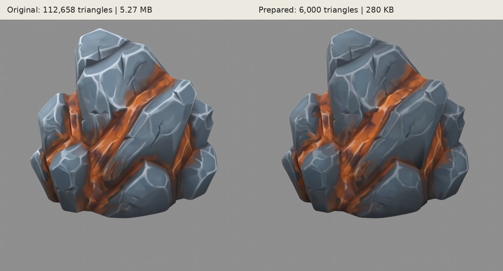
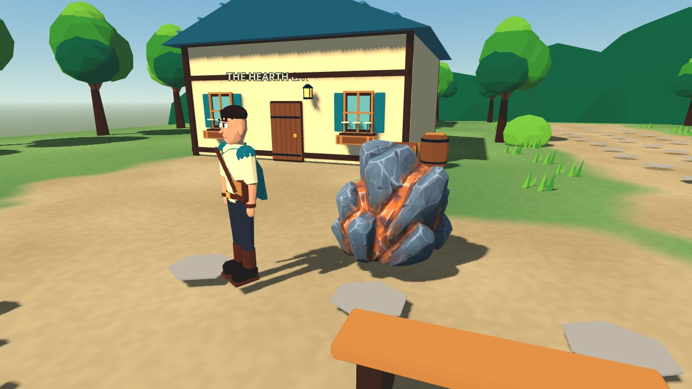

# Iron ore asset trial — 0.2.2

The source is Jamie's Meshy 6 Lite export `Meshy_AI_Molten_Stone_Cluster_0925203905_texture.glb`, created through the website using an image reference. The original uploaded file is preserved separately and is not overwritten. The source is not packaged into the game.

## Result

| Property | Source | Runtime candidate |
|---|---:|---:|
| Triangles | 112,658 | 6,000 |
| GLB bytes | 5,272,160 | 280,196 |
| Colour texture | 2048 × 2048 | 1024 × 1024 |
| Materials | 1 | 1 |

The runtime version is 94.7% smaller by file size and has 94.7% fewer triangles. This is not a measured FPS improvement. It is scaled to 1.25 metres tall, centred horizontally and grounded at its base.

Blender welded coincident import vertices before decimation; the first unwelded attempt exposed seam cracks in renders and was discarded. UV coordinates were retained through simplification. A soft colour mask attenuates bright neutral/cool markings by at most 25%, protecting the orange mineral colour. Material roughness is 0.95 and metallic is zero. There is no emission or expensive auxiliary map stack.

**Limit:** this pass softens painted markings but does not reconstruct the remaining stretched/smeared orange texture areas. Those are still visible close up. No claim is made that the UVs or painted content have been fully repaired. Compare at actual gameplay distance before spending time on local repainting.



## In-game trial

One instance sits just outside the inn at village coordinates (-8, 3); another is beside the woodland approach at (3, 12). These are scenery with simple cylinder collisions, not working mining nodes. Story, inventory and save schema are unchanged. The new game version is 0.2.2 so Android can install it as an update.

`game/tests/ore_preview.gd` places the rock beside Rowan using the normal world lighting and camera. Run it with Godot's `--script` option; it writes a rendered screenshot to `/tmp/ore-godot.png` when a display is available.



Validation: Godot 4.5.1 import completed, all 38 rule checks passed, and the dedicated rendered scene completed with `ORE_PREVIEW_PASS`. Phone performance remains to be checked on the new APK.

## Reproduction and source

Run Blender 4.3.2 from the repository root:

```
blender --background --python tools/prepare_ore.py -- /path/to/Meshy_AI_Molten_Stone_Cluster_0925203905_texture.glb
```

The script writes the runtime GLB, statistics, original/prepared comparison renders, and a local Blender study file. The study file includes the high-resolution source for editing; it is excluded from git because it is reproducible from the preserved original. It is not a runtime asset. The comparison JPEGs in this document are derived from those renders.

## Attribution

“Molten Stone Cluster” / iron ore outcrop, generated by Jamie using [Meshy](https://www.meshy.ai/), Meshy 6 Lite Free plan, 25 September 2026. Licensed under [Creative Commons Attribution 4.0](https://creativecommons.org/licenses/by/4.0/). Adapted for The Unfinished Dawn: welded and reduced mesh, changed texture contrast/resolution, material, scale and placement. Reference image supplied by Jamie through the image-generation workflow discussed during development. This credit also appears in the game's credits.
